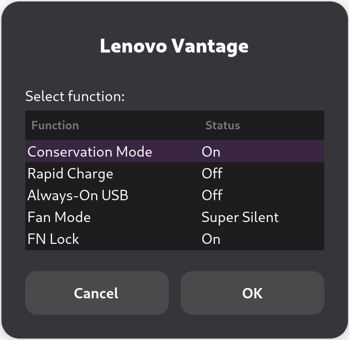

# Lenovo Vantage for Linux
This shell script helps you to provide [Lenovo Vantage](https://www.lenovo.com/us/en/software/vantage) in GNU/Linux operating system.

## :rocket: Features


* Conservation Mode — Limit battery charge to prolong its life
* [Rapid Charge](https://github.com/cwright814/vantage#advanced-power-management-lenovo-legion-systems) — 140W charging while powered off for Lenovo Legion systems
* Always-On USB — Enable USB power output when the system is in low-power modes
* Thermal/Fan Mode — Quiet, balanced and performance modes
* FN Key Lock
* Camera Privacy Switch
* Microphone Privacy Switch
* Touchpad Switch
* Wi-Fi Switch

## :computer: Installation

First of all, you need to clone the repository with this command:
```bash
git clone https://github.com/niizam/vantage.git
cd vantage
```
Then you can easily run this command:

```bash
sudo make install
```
Run "Lenovo Vantage" from your applications list.

## :hotsprings: Uninstall
To uninstall Lenovo Vantage, you can just run this:

```bash
sudo make uninstall
```

## :warning: Requirements
* `zenity`
* `xorg-xinput` or `xinput`
* `networkmanager`
* `pulseaudio` or `pipewire-pulse`

if they are not already installed, you can install them using your package manager.

For Arch Linux:
```bash
sudo pacman -S zenity xorg-xinput networkmanager
``` 
For Debian derivatives (Ubuntu, Mint, Pop!_OS, etc):
```bash
sudo apt install zenity xinput
```
For Fedora:
```bash
sudo dnf install zenity xinput NetworkManager pipewire-pulseaudio
```

## :zap: Optional Enhancements

### Advanced Power Management (Lenovo Legion Systems)

To enable the Lenovo Legion "Rapid Charge" toggle, your system requires the "ACPI Call" kernel module.

> [!WARNING]
> If you use Secure Boot, you must either sign the compiled kernel module or disable Secure Boot in your BIOS for this driver to load.

Install the required packages for your distribution (skip linux-headers if already installed i.e. via XanMod):

**Debian / Ubuntu / Pop!_OS / Mint:**
```bash
# Install build tools and kernel headers
sudo apt install dkms build-essential linux-headers-$(uname -r)

sudo apt install acpi-call-dkms
```

**Arch Linux:**
```bash
# Install kernel headers
sudo pacman -S linux-headers

yay -S acpi_call-dkms
```

**Fedora:**
```bash
# Install build tools and kernel headers
sudo dnf install dkms kernel-devel

# Enable the Copr repository
sudo dnf copr enable rhea/acpi_call

sudo dnf install acpi_call-dkms
```

The application automatically detects the module at startup. If available, the Rapid Charge option appears in the menu.

> [!NOTE]
> Conservation Mode and Rapid Charge are mutually exclusive - enabling one disables the other. This is a hardware limitation.
